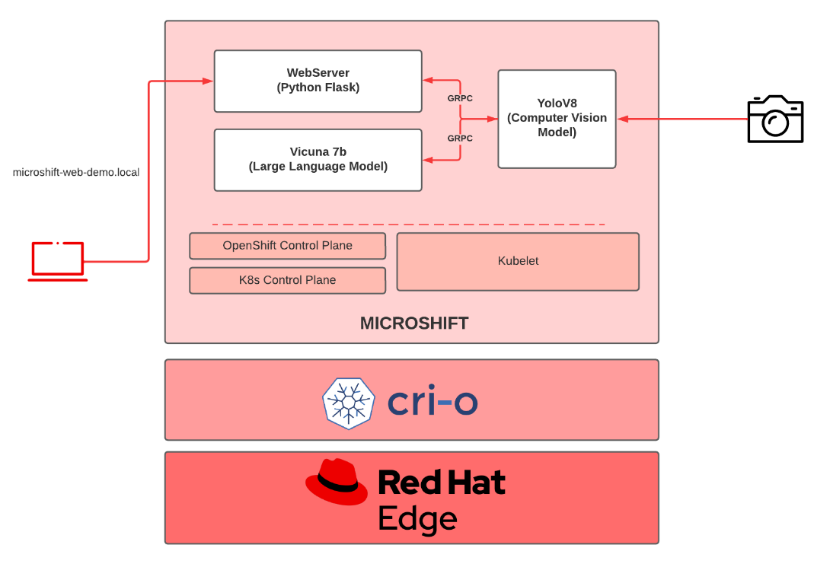
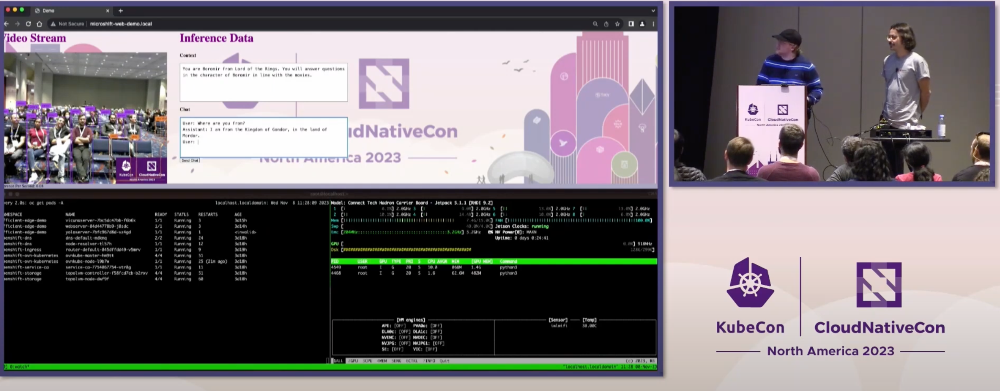

# Efficient Edge AI Demo

This repository demonstrates how to run various AI models at the edge by optimizing them. Specifically, it showcases the integration of a computer vision model (YOLOv8) and a language model (Vicuna 7B) using gRPC calls. This setup simulates real-time capabilities, akin to connecting eyes (YOLOv8) to a brain (Vicuna 7B).

## Table of Contents

- [Overview](#overview)
- [Prerequisites](#prerequisites)
- [Architecture](#architecture)
- [Deployment](#deployment)
- [Build](#build)
- [Authors](#authors)

## Overview

Welcome to the Efficient Edge AI Demo, where we bring AI models to life at the edge! Imagine giving a computer vision model the eyes to see (YOLOv8) and connecting it to a brain that can think and respond (Vicuna 7B). By optimizing these models and enabling them to communicate through gRPC calls, we create a seamless system that perceives and interprets visual data in real-time.

This project showcases the power of edge AI, demonstrating how optimized models can work together to provide intelligent, real-time insights in low resource environments. Whether you're interested in enhancing IoT devices, improving smart cameras, or developing autonomous systems, this demo provides a sample blueprint for integrating advanced AI capabilities at the edge.

## Prerequisites

Before you begin, ensure you have met the following requirements:

- A Jetson device with a minimum of 16GB of memory (such as the NVIDIA Jetson Orin NX or AGX Orin)
- Red Hat Enterprise Linux 9.4
- MicroShift 4.15
- Jetpack 6
- CUDA 12.2

You can use the container images that are provided in the deployment files for this demo and it should work out of the box. If you want to customize this demo, we will explain the build process by the end of the README.

## Architecture

As mentioned above, this demo is entirely running on a single NVIDIA Jetson device. This single node runs an edge optimized operating system such as RHEL for Edge, a variant of Red Hat Enterprise Linux that ships specific technologies suitable for the edge. On top of that, a lightweight Kubernetes distribution called MicroShift is running that will allow us to run cloud-native workloads the same way you would run in the datacenter. The container runtime of choice is CRI-O, althought it works alongside NVIDIA's container runtime.

At the application level, there are three different Kubernetes deployments that will run a Flask webserver, YoloV8 and Vicuna. The YoloV8 pod is the one accessing the webcam attached to the NVIDIA Jetson, while the user will access the demo environment via a web browser exposed by the Flask webserver pod.

This is a simple diagram of the architecture:



## Deployment

WARNING: This demo sets up a *privileged* namespace called efficient-edge-demo in order to access /dev/video0 (usually a webcam or MIPI camera) on the host. Please use privileged namespaces carefully and keep in mind this is not best practice.

We assume that Red Hat Enterprise Linux 9.4 is running on the Jetson Orin NX/AG Orin device with a camera connected to it. In addition, we assume MicroShift 4.15 is running. For installing MicroShift, please, follow the [official documentation](https://access.redhat.com/documentation/es-es/red_hat_build_of_microshift/4.15).

To create the namespace, deployments, services, and route apply the demo.yaml file
```oc apply -f demo.yaml```

The route will be named: microshift-web-demo.local


MicroShift offers mDNS resolution for routes that end with the .local domain. If a machine, equipped with an mDNS daemon like Avahi or Bonjour, attempts to access the webserver from the same local network, it will automatically resolve the route's IP. This enables seamless access to the webserver. If that's not the case, on your host system, add an entry to your hosts file (/etc/hosts for Mac/Linux or C:\Windows\System32\drivers\etc\hosts for Windows) to point the route name above to the IP of your Jetson.

Visit the web page in a browser to use the demo app.

## Build

The build process relies on the Containerfiles stored in the `containerfiles` directory. This is an optional step as the container images specified in the demo.yaml are fully working.

#### Webserver build

`podman build -f containerfiles/webserver.Containerfile -t quay.io/oglok/efficient-edge-ai-demo-webserver:jetpack-6 src/`

#### Vicuna build

`podman build -f containerfiles/vicunaserver.Containerfile -t quay.io/oglok/efficient-edge-ai-demo-vicunaserver:jetpack-6 src/`


#### YoloV8 build

NVIDIA is moving its container stack to make use of the new Container Device Interface (CDI). Only if you use Podman >= 1.36, the build command could support the `--device` flag. Otherwise, we need to compile YoloV8 with TensorRT either on the host, or within a container using `podman run`.

For that, execute:

`podman run -it --device nvidia.com/gpu=all --group-add keep-groups --security-opt label=disable -v ./src/:/root/ nvcr.io/nvidia/l4t-ml:r36.2.0-py3 bash`

And execute the following commands:

```
cd /root/
pip install --no-cache ultralytics setuptools tqdm lapx matplotlib
yolo export model=yolov8n.pt format=engine device=0
pip install grpcio-tools
cd protobuf && python3 -m grpc_tools.protoc -I./ --python_out=. --pyi_out=. --grpc_python_out=. ./yoloserving.proto
exit
```


`podman build -f containerfiles/yoloserver.Containerfile -t quay.io/oglok/efficient-edge-ai-demo-yoloserver:jetpack-6 src/`


Of course, replace oglok by your Quay user or registry.


## Authors

This demo has been developed by Alexander Mevec and Ricardo Noriega and presented for the first time at Kubecon 2023 Chicago.

You can see a video of the entire presentation in the following [link](https://www.youtube.com/watch?v=11CzoVex7rU)


